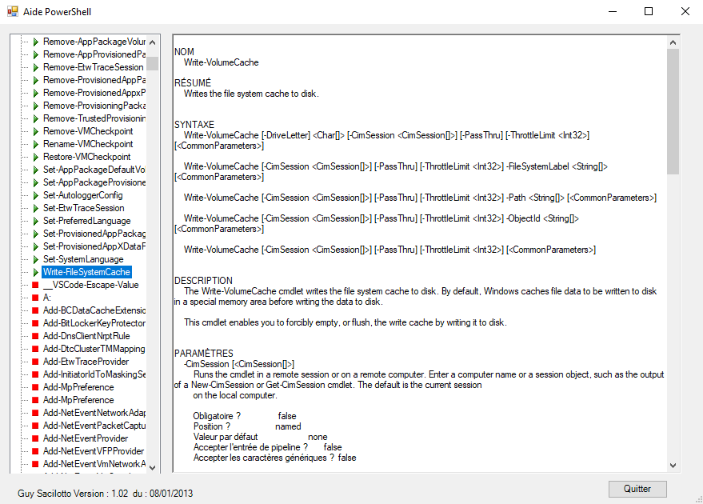

# PowerShell_Help

## Description
This [Powershell](https://learn.microsoft.com/powershell/scripting/overview) script creating a GUI to display PowerShell Help.

## Screens

## Requirements

-|version
--|:--:
PowerShell|>=5
.NET|>=4

## Download

[github-download]: https://github.com/MrGuyTwo/PowerShell_Help/releases
 - [`PowerShell_Help`][github-download]

